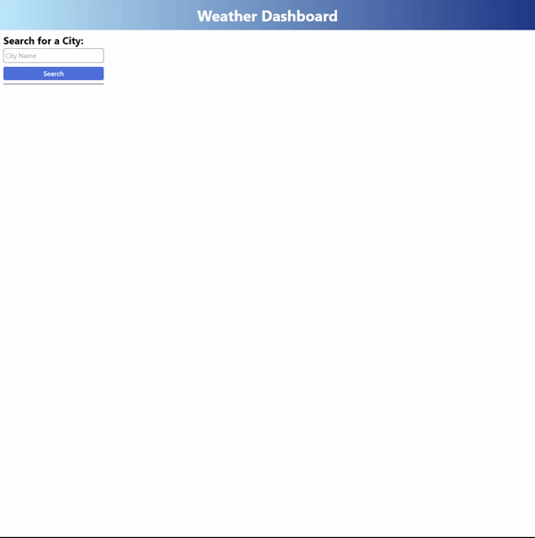

# Weather Dashboard

## Description

The Weather Dashboard is can be used to search the current and five forecast of a given city name. To get the data it uses javaScript .fetch() method. The request is made to http://api.openweathermap.org/. Then it uses more javaScript code to pull the need values and dynamically builds the HTML needed to present the results to the user.

## Table of Contents (Optional)

## Installation

## Usage

https://sjuan634.github.io/weather-dashboard/

## Credits

## License

## Badges

## Features

## How to Contribute

## Tests
